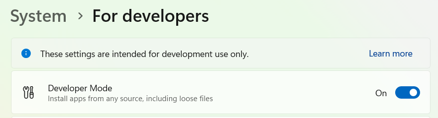
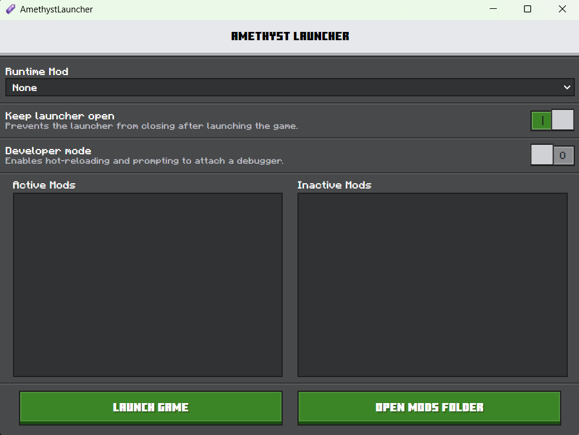
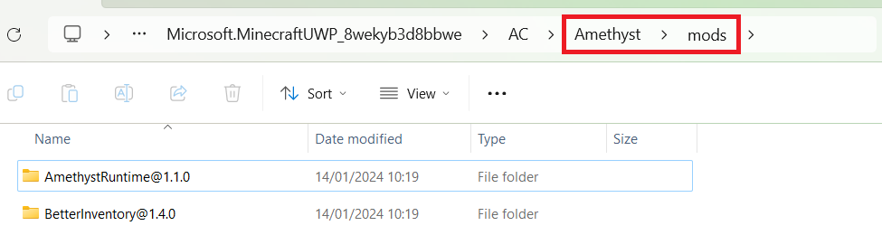
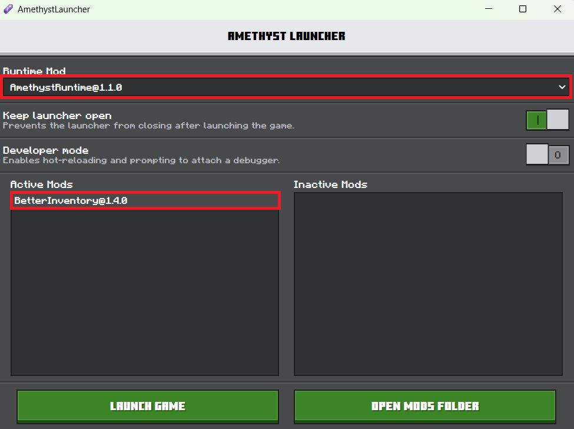

# 1.1 - Installing Amethyst

First start by going into Windows settings, find the `Developer Mode` setting and enable it.

## Version Switcher

To install Amethyst you will need to install an existing 3rd party version switcher, this is because Amethyst has to be installed via loose files, and therefore cannot be installed through the Microsoft Store.

Some example version switchers include:
 - [Bedrock Launcher](https://bedrocklauncher.github.io/)
 - [MCMrARM's switcher](https://github.com/MCMrARM/mc-w10-version-launcher)

Currently Amethyst is targeting specifically version `1.20.51.1`, so make sure you explicitly use that version. Avoid using options like `latest`.

## Amethyst Launcher

To download AmethystLauncher go to [Amethyst's Releases](https://github.com/FrederoxDev/Amethyst/releases). Search for the latest release which includes an installer `Amethyst.Launcher.Setup.x.x.x.exe`. After running the installer you should be able to open up the launcher App.

## Installing Mods

To test out Amethyst download the latest release of `Better Inventory`, or the mod of your choice, inside of that release there will likely be two folders, one for the mod and one for the runtime. In Amethyst Launcher, click `Open Mods Folder` and drag in those folders. 

Press `Ctrl + R` to reload the mods, and then open the `Runtime Mod` dropdown and select the version of `AmethystRuntime` provided by your downloaded mod. Also click on the mod in the `Inactive Mods` list to enable it.

Now you can press `Launch Game`, and if everything is setup right the game should launch with the mods!