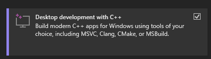

# 1.1 - Required tools

TODO: Rewrite this..

<!-- ## Git
- Download Link: [git-scm.com](https://git-scm.com/downloads)
- In this guide, many resources have been hosted on GitHub. It is recommended that you have the `git` command line tool installed.

## Visual Studio Community
- Download Link: [visualstudio.microsoft.com/vs/community/](https://visualstudio.microsoft.com/vs/community/)
- Visual Studio Community will be used as the editor for writing c++ code, you can download it here. 
- Make sure to select C++ support inside of the installer.

## Ghidra
- Download Link: [ghidra-sre.org](https://ghidra-sre.org/)
- Ghidra will be used to reverse-engineer and analyse Minecraft

## ZenovaLauncher
- Download Link: [github.com/MinecraftZenova/ZenovaLauncher](https://github.com/MinecraftZenova/ZenovaLauncher)

## Zenova
- Please follow all of the pre-requisites for Zenova here: [https://github.com/MinecraftZenova/Template#prerequisites](https://github.com/MinecraftZenova/Template#prerequisites) -->
