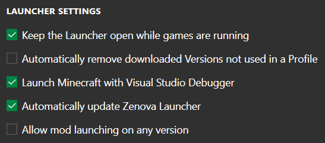
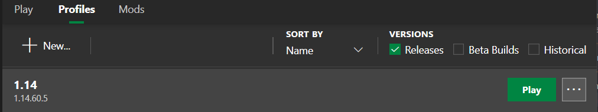
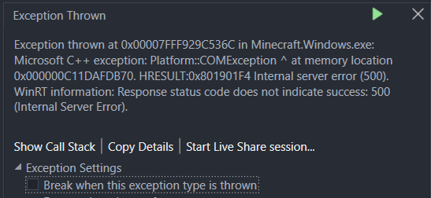

# 2 - First Project

> This chapter will lead you through the basics of `"Hooking"` functions in ZenovaAPI by creating your own custom item. Please keep in mind that this chapter is significantly easier then later sections, since the headers have already been created for you. Be prepared for a difficultly increase later on.

## Quick Project Setup
Open up a powershell instance in the folder in which you want your project folder to be in. Hover over the top right side of the commands below and click `Copy to Clipboard` and paste it into **Powershell (not CMD)**. This will setup your entire project ready to complete the following chapters.
```powershell
git clone https://github.com/FrederoxDev/Modding-Guide-Template
cd Modding-Guide-Template
Remove-Item -Recurse -Force .git
git init
git submodule add https://github.com/FrederoxDev/Bedrock-Headers

$Path = "./resources/assets/manifest.json"
(Get-Content $Path).replace("uuid1", (New-Guid)) | Set-Content $Path
(Get-Content $Path).replace("uuid2", (New-Guid)) | Set-Content $Path

cmake . -Bbuild
start build/Example.sln
```

## Configuring Settings
1. In Visual studio change `Release` to `RelWithDebInfo`
    
    

<br />

2. Next go to the top menubar, and press `Build Solution` under the `Build` tab, or use the shortcut <kbd>Ctrl + Shift + B</kbd>

    

<br />

3. Launch `ZenovaLauncher` (reload if it is already open), and open the settings menu by clicking on the button in the bottom left, and copy the following settings

    

<br />

4. Go to the `profiles` tab and configure version `1.14.60.5` by pressing the 3 dots on the right side. Finally add `Template Name` to the list of loaded mods

    
    

## Building the Project

Whenever you make changes to your project you will need to rebuild the solution with <kbd>Ctrl + Shift + B</kbd>, or by pressing `Build Solution`. To build the project you need to close all open instances of Minecraft. Simply then launch the game through ZenovaLauncher on your `1.14.60.5` profile.

1. Next you will be prompted to attach a debugger, make sure that your instance of `Visual Studio` is selected and press `OK`.

    

<br />

2. You will run into two breakpoints in Visual Studio, simply press the `Continue` button. One is from Minecraft and the other one is from ZenovaAPI.

<br />

3. You may run into an error while the game loads, that looks like this. If you get it simply uncheck `Break when this exception type is thrown` as this is not an issue caused by Zenova or your mods, and it can be ignored. Unchecking it will disable this error from pausing the game again. Then simply press the `Continue` button.

    

<br />

4. If this is the first time building the project, the example mod should print a simple `"Hello World"` into the console
    ```
    [Info] [ModStart] Hello World!
    ```