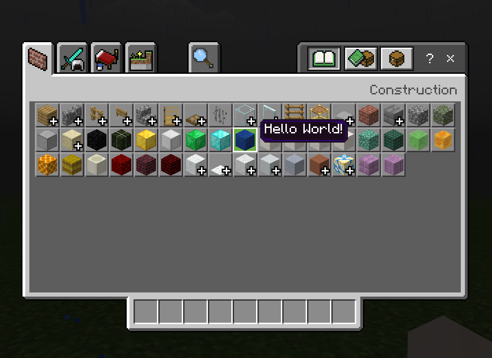

# 2.3 - Intro to Hooking

To begin creating code to interact with Minecraft, a concept called `Hooking` can be used. Hooking allows code to be injected before or after existing functions, as well as being able to get the parameters passed to the function, and modify what is passed to the actual function.

## Hooks in Zenova
First of all, ZenovaAPI provides two types of Hooks:
- `Zenova_Hook` - used to hook static and member functions
- `Zenova_VHook` - used to hook virtual functions

To begin this guide will show you how to modify the behaviour of hovering over items. Firstly add an include to the item header as shown below:
```h
#include "Minecraft/Items/Item.h"
```

You can open up the header file by holding down `Ctrl` and clicking on the include. Inside you can see all of the virtual functions that are used by the Item class. Specifically to modify the behaviour for hovering over items, you would hook `appendFormattedHovertext`.

Navigate to `appendFormattedHoverText` in `Minecraft/Items/Item.h`
```h
virtual void appendFormattedHovertext(const ItemStackBase&, Level&, std::string&, const bool) const;
```


## Defining a hook
1. Firstly a "trampoline" is needed, a trampoline is a function containing a copy of the original functions code. As `appendFormattedHoverText` is a `virtual` function, the first parameter passed will be a pointer to the class, in this case `Item`. Next it needs to take in all of the arguments of the original function.
```h
inline static void (*_appendFormattedHoverText)(Item*, const ItemStackBase&, Level&, std::string&, const bool);
```

<br />

2. To make the hook, firstly copy the parameters of your trampoline, next you will need to give each argument an identifier. In this hook it is calling the "trampoline" function, but it is also printing `"Hook called!"` into the console.
```h
static void appendFormattedHoverText(Item* item, const ItemStackBase& itemBase, Level& level, std::string& hoverText, const bool showCategory) 
{
    // Call the original piece of code so it still behaves like normal
    _appendFormattedHoverText(item, itemBase, level, hoverText, showCategory);

    // Print to console to test if it is working
    Zenova_Info("Hook called!");
}
```

<br />

3. Next you need to tell ZenovaAPI to hook the function using `Zenova_VHook`. To test it, build the project and hover over any items in your inventory, the hovering should still work with normal behaviour, but it will also be flooding the console with messages!
```h
MOD_FUNCTION void ModStart() 
{
    Zenova_VHook(Item, appendFormattedHoverText, &appendFormattedHoverText, &_appendFormattedHoverText);
}
```

<br />

4. Calling the trampoline is not actually mandatory, here it has been removed and the hoverText has been set to a constant value of `"Hello World!"`
```h
static void appendFormattedHoverText(Item* item, const ItemStackBase& itemBase, Level& level, std::string& hoverText, const bool showCategory) 
{
    hoverText = "Hello World!";
}
```

<br />


