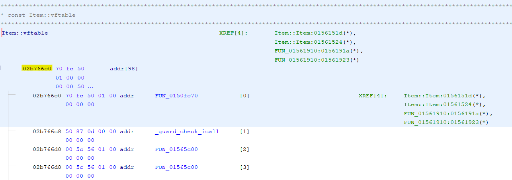
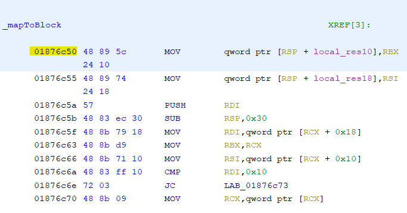

# 3.4 - Finding Addresses

When finding addresses they all need to be gathered from the `1.14.60.5 Windows Client`, addresses from other versions **cannot** be used. However the Windows Client does not contain symbols, so to find functions, known details can be compared between the server and client to find where the function is used and gain its address.

## VTable Addresses

To use virtual functions on a class you will need to get the address of the vtable, luckily for Minecraft 1.14.60.5 this is an easy task. To get started locate the `vtable` for your class on the `Windows Client` and open it on the listing view. The address you will need will be the first address in the vtable, and is highlighted in yellow in the image below.

## Finding Functions

> To find addresses for non virtual functions, it will take alot more work and time. These are different methods you can use to locate the function, however they can all be used with eachother to locate your function.

- ### Constructors (Ctors) & Destructors (Dtors)
    - Ctors and Dtors can easily be found by cross referencing the `vtable` for the class. The image below shows 4 references, but there are only two unique functions, each highlighted in yellow. 

        

     

    - Dtors tend to contain calls to other dtors so you can determine what it is by that

- ### Cross-Referencing using Known Functions
    - If you have an already known function, you are able to use this to label all the functions called in that function too, by comparing it against the Windows Server and/or Mac Client.
    
    - Additionally you can also use this to find functions which call the known function by looking at the XRefs, although this is more effective for lesser-called functions.

- ### Cross-Referencing Strings
    1. If a function contains a string on the `Windows Server`, you can copy the string and on the `Windows Client` press <kbd>S</kbd> or `Search > Memory`. Next set the `Format` to `String` and enter the string into the `Search Value` and press `Search All`.

     

    2. This will then bring up a list of strings which contain that string, search through the list to locate the string with the identical name and click on it to jump to it in the `Listing` window.

        

        

     

    3. In this example there is only one function, which means that `FUN_01876c50` is `_mapToBlock`. Now in Ghidra copy the name on the client (`FUN_01876c50`), and press <kbd>G</kbd> or `Navigation > Go To`, this will take you to the very top of the function so you do not have to scroll. Next right click on the function name and select `Edit Function` and change the name of the function to the one on the Server.

     

    4. If there were multiple XRefs, you will have to check each function and compare more details between the Client and Server to find the correct one. 

## Getting the Function Address

Once you have found your function on the Client, the address will be the address of the first instruction and is highlighted in yellow in the image below.

